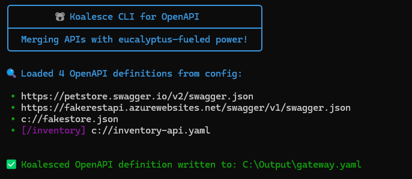

 

**Koalesce** is a .NET library designed to merge multiple API definitions into a unified document. It enables seamless API Gateway integration and simplifies frontend client generation for microservices-based architectures.

---

## How It Works?

**Process:**
- Koalesce fetches API definitions from the specified **Sources**.
- It merges them using the an available `provider` (e.g, `Koalesce.OpenAPI`), generating a single schema at **MergedDocumentPath**.
- The final *Koalesced* API definition is serialized and available in `JSON` or `YAML` format.

### ⚡ Key Features

- ✅ Coalesce multiple API definitions into one unified schema.
- ✅ Fully configurable via `appsettings.json` or Fluent API.
- ✅ Fail-Fast Validation: Validates URLs and paths at startup to prevent runtime errors.
- ✅ Flexible Security Handling: Apply global Gateway security or preserve downstream API security configurations.
- ✅ Aligns perfectly with API Gateways (**Ocelot**, **YARP**).
- ✅ Allows output a `json` or `yaml` merged document regardless the document type of the source APIs.
- ✅ Streamlines API client generation (e.g., **NSwag**, **Kiota**) since it results in one unified schema.
- ✅ Multi-targeting: Native support for **.NET 8.0 (LTS)** and **.NET 10.0**.
- ✅ Agnostic Core: Designed to support future providers implementing other API specification formats (e.g., gRPC, GraphQL).

---
## 📦 Installation

#### 🟢 Koalesce for OpenAPI Middleware (ASP.NET Core)


```sh
# Package Manager
NuGet\Install-Package Koalesce.OpenAPI -Version 1.0.0-alpha.6
```
```sh
# .NET CLI
dotnet add package Koalesce.OpenAPI --version 1.0.0-alpha.6
```

#### 🟢 Koalesce.OpenAPI.CLI as a Global Tool


To install the **Koalesce.OpenAPI.CLI** globally:

```bash
dotnet tool install --global Koalesce.OpenAPI.CLI --version 1.0.0-alpha.5
```

---

### ⚙️ Configuration

Koalesce configuration is divided into **Core Options** and **Provider Options** (e.g., OpenAPI).

- 💡 Parameters listed with 🔺 are required.
- 💡 The file extension `[.json, .yaml]` defined in **MergedDocumentPath** determines the output format.

<br/>

#### 1️⃣ Core Configuration (`Koalesce`)

| Setting | Type | Default Value | Description |
|---|---|---|---|
| `Sources` | `array` | 🔺 | List of API sources. Each item contains `Url` and **optional** `VirtualPrefix`. |
| `MergedDocumentPath` | `string` | 🔺 | Path where the merged API definition is exposed. |
| `Title` | `string` | `"My 🐨Koalesced API"` | Title for the Koalesced API definition. |
| `SkipIdenticalPaths` | `boolean` | `true` | If `false`, throws exception on duplicate paths. If `true`, logs warning and skips duplicates. |

<br/>

#### Caching Configuration (`Koalesce.Cache`)

| Setting | Type | Default Value | Description |
|---|---|---|---|
| `DisableCache` | `boolean` | `false` | If `true`, recomputes the merged document on every request. |
| `AbsoluteExpirationSeconds` | `integer` | `86400` (24h) | Max duration before a forced refresh of merged result. |
| `SlidingExpirationSeconds` | `integer` | `300` (5 min) | Resets expiration on every access. |
| `MinExpirationSeconds` | `integer` | `30` | Minimum allowed expiration time. |

<br/>

#### 2️⃣ OpenAPI Provider Configuration

These settings are specific to the `Koalesce.OpenAPI` provider.

| Setting | Type | Default Value | Description |
|---|---|---|---|
| `OpenApiVersion` | `string` | "3.0.1" | Target OpenAPI version for the output. |
| `ApiGatewayBaseUrl` | `string` | `null` | The public URL of your Gateway. Activates **Gateway Mode**. |
| `OpenApiSecurityScheme` | `object` | `null` | Optional global security scheme (e.g., JWT, ApiKey) for the Gateway. `When configured, it's applied to all operations. When omitted, downstream security is preserved as-is.` |

---

### 🔐 Gateway Security Configuration

Koalesce provides a simple, intuitive security model:

#### ✅ With `OpenApiSecurityScheme` (Global Gateway Security)

**Use when:** Your Gateway handles authentication and you want all operations to require Gateway auth.

```json
{
  "Koalesce": {
    "ApiGatewayBaseUrl": "https://gateway.com",
    "OpenApiSecurityScheme": {
      "Type": "Http",
      "Scheme": "bearer",
      "BearerFormat": "JWT",
      "Description": "JWT Authorization"
    }
  }
}
```

**Result:** All operations in the merged document require Gateway authentication. Ideal for NSwag/Kiota client generation with centralized auth.

---

#### ✅ Without `OpenApiSecurityScheme` (Preserve Downstream Security)

**Use when:** You want to preserve each downstream API's security configuration exactly as-is.

```json
{
  "Koalesce": {
    "ApiGatewayBaseUrl": "https://gateway.com"
    // No OpenApiSecurityScheme = preserve downstream security
  }
}
```

**Result:**

- Operations with security in downstream APIs → Keep their security requirements
- Operations without security in downstream APIs → Remain public
- Mixed public/private scenarios are supported naturally

**Example:** If CustomersAPI has JWT security and ProductsAPI is public, the merged document will reflect exactly that - Customers operations require auth, Products operations don't.

---

##### 📝 `appsettings.json` Examples

**Aggregation Mode (No Gateway):**

```json
{
  "Koalesce": {
    "Sources": [
      { "Url": "https://service1.com/swagger.json" },
      { "Url": "https://service2.com/swagger.json" }
    ],
    "MergedDocumentPath": "/swagger/v1/all-apis.json",
    "Title": "All APIs Documentation"
  }
}
```

**Gateway Mode (With Global Security):**

```json
{
  "Koalesce": {
    "Sources": [
      {
        "Url": "https://localhost:8001/swagger/v1/swagger.json",
        "VirtualPrefix": "customers"
      },
      {
        "Url": "https://localhost:8002/swagger/v1/swagger.json",
        "VirtualPrefix": "inventory"
      }
    ],
    "MergedDocumentPath": "/swagger/v1/apigateway.json",
    "Title": "API Gateway",

    // Gateway Mode Configuration
    "ApiGatewayBaseUrl": "https://localhost:5000",
    "OpenApiSecurityScheme": {
      "Type": "Http",
      "Scheme": "bearer",
      "BearerFormat": "JWT",
      "Description": "JWT Authorization"
    },

    // Caching
    "Cache": {
      "AbsoluteExpirationSeconds": 86400,
      "SlidingExpirationSeconds": 300
    }
  }
}
```

> **Note on `VirtualPrefix`:** When you define a prefix (e.g., `"inventory"`), Koalesce modifies the path in the documentation (e.g., `/api/get` becomes `/inventory/api/get`). Your API Gateway (e.g., Ocelot/YARP) must be configured to route this prefixed path back to the original downstream service.

---

## How to use Koalesce?


#### 🛠️ Using Koalesce as Middleware in your .NET Application

In the `Program.cs` of your gateway project, register service and enable the middleware.

##### 1️⃣ Register Koalesce.[ForProvider()]

```csharp
builder.Services.AddKoalesce(builder.Configuration)
    .ForOpenAPI(); // Add options lambda here for fluent security config
```

##### 2️⃣ Enable Middleware

```csharp
app.UseKoalesce();
```

##### 🔐 Security Configuration through Fluent API

Koalesce provides a set of fluent extension methods to easily configure common security scenarios. When `ApiGatewayBaseUrl` is set, you **must** define a `OpenApiSecurityScheme` either via `appsettings.json` or the fluent API.
Without it, Koalesce can't know how to document the authentication mechanism for your API Gateway and will throw an exception at startup.

If using the Middleware, it's recommended you specify the security configuration inside the provider options to keep your `appsettings.json` clear of a OpenApiSecurityScheme.

##### Available Extension Methods

- `ApplyGlobalJwtBearerSecurityScheme`: Configures standard JWT Bearer Token authentication.
- `ApplyGlobalApiKeySecurityScheme`: Configures API Key authentication (Header, Query, or Cookie).
- `ApplyGlobalBasicAuthSecurityScheme`: Configures HTTP Basic Authentication.
- `ApplyGlobalOAuth2ClientCredentialsSecurityScheme`: Configures OAuth2 Client Credentials flow.
- `ApplyGlobalOAuth2AuthCodeSecurityScheme`: Configures OAuth2 Authorization Code flow.
- `ApplyGlobalOpenIdConnectSecurityScheme`: Configures OpenID Connect (OIDC) via Discovery Document.

**Example:**

```csharp
builder.Services.AddKoalesce(builder.Configuration)
    .ForOpenAPI(options =>
    {
        // Example 1: JWT Bearer (Most Common)
        options.ApplyGlobalJwtBearerSecurityScheme(
            schemeName: "Bearer",
            description: "Enter your JWT token"
        );

        /* Other examples:

        // Example 2: API Key
        options.ApplyGlobalApiKeySecurityScheme(
            headerName: "X-Api-Key",
            location: ParameterLocation.Header
        );

        // Example 3: OAuth2 Client Credentials
        options.ApplyGlobalOAuth2ClientCredentialsSecurityScheme(
            tokenUrl: new Uri("https://auth.example.com/connect/token"),
            scopes: new Dictionary<string, string> { { "api.read", "Read Access" } }
        );

        // Example 4: OpenID Connect (OIDC)
        options.ApplyGlobalOpenIdConnectSecurityScheme(
            openIdConnectUrl: new Uri("https://auth.example.com/.well-known/openid-configuration")
        );
        */
    });
```

> 💡 Check the **Koalesce.Samples.Swagger.Ocelot** project for a complete implementation of all these scenarios.


<br/>

#### 💻 Using Koalesce.OpenAPI through CLI (Command Line Interface)

The `Koalesce.OpenAPI.CLI` tool was built specifically to allow the usage of Koalesce for merging OpenAPI definitions directly into a file in the disk, without the need for a .NET application hosting the middleware.



#### Arguments:

- 🔺`--config` specifies the path to your `appsettings.json`.
- 🔺`--output` defines the path for the merged OpenAPI spec file.
- `--verbose` enables detailed logging.
- `--version` displays the current version.

#### Example

```bash
koalesce --config ./config/appsettings.json --output ./merged-specs/apigateway.yaml --verbose
```

> **💡 Security:** When using the CLI, `OpenApiSecurityScheme` is optional. If you want to apply global Gateway security, include it in the `appsettings.json` file. If omitted, downstream API security configurations are preserved as-is.

```json
  "Koalesce": {
    "OpenApiVersion": "3.0.1",        
    "ApiGatewayBaseUrl": "https://localhost:5000",
    "OpenApiSecurityScheme": {  // sample using JWT
      "Type": "Http",
      "Scheme": "bearer",
      "BearerFormat": "JWT",
      "Description": "JWT Authorization header using the Bearer scheme."
    }
}
```

---

## ⚠️ Important Considerations and Limitations

#### 🔐 Security Schemes & Authorization

Koalesce provides flexible security handling:

- **With `OpenApiSecurityScheme`**: Applies global Gateway security to all operations in the merged document
- **Without `OpenApiSecurityScheme`**: Preserves each downstream API's security configuration exactly as-is
- Downstream security schemes (Bearer, ApiKey, etc.) are always preserved in `components.securitySchemes` for reference

#### 🔀 Handling Identical Routes

If two or more microservices share the same route (e.g., `/api/health`), a collision occurs.

🔹 **How to resolve this?**

1.  **Use `VirtualPrefix` (Recommended):**
    Assign a unique prefix in `appsettings.json` (e.g., `inventory`, `products`).
    - Koalesce transforms `/api/health` into `/inventory/api/health`.
    - This ensures unique paths in the documentation.
    - *Requires API Gateway URL Rewrite configuration.*

2.  **Order of Precedence:**
    - If `VirtualPrefix` is not used, the **order of Sources** determines precedence.
    - By default (`SkipIdenticalPaths: true`), duplicates are ignored (first wins).

---

#### 📝 License

Koalesce is licensed under the [**MIT License**](https://github.com/falberthen/Koalesce/blob/master/LICENSE).

#### ❤️ Contributing

Contributions are welcome! Feel free to open issues and submit PRs.

#### 📧 Contact

For support or inquiries, reach out via **GitHub Issues**.

#### 📜 Koalesce Changelog

See the full changelog [here](https://github.com/falberthen/Koalesce/blob/master/CHANGELOG.md).

#### 📜 Koalesce.OpenAPI.CLI Changelog

See the full changelog [here](https://github.com/falberthen/Koalesce/tree/master/src/Koalesce.OpenAPI.CLI/CHANGELOG.md).