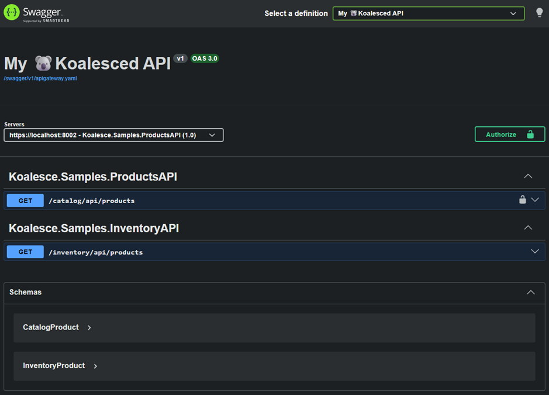
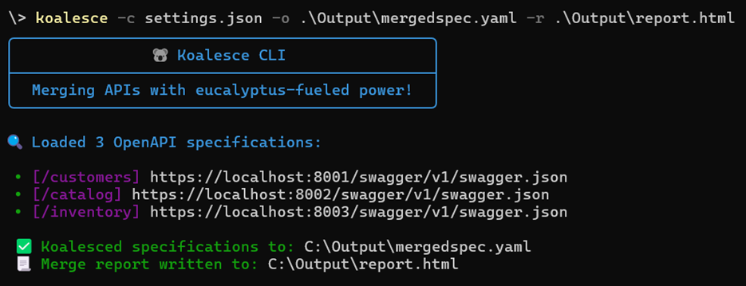

# Koalesce


**Koalesce** is an open-source .NET library that merges multiple OpenAPI specifications into a single unified definition.

<br/>

  [](https://opensource.org/licenses/MIT) [](https://www.paypal.com/donate?business=CFZAMDPCTKZY6&item_name=Koalesce&currency_code=CAD)

 

⭐ **If you find Koalesce useful, please consider giving it a star!** It helps others discover the project.  [](https://github.com/falberthen/Koalesce/stargazers)

---

## 🧩 The Problem

Building microservices or modular APIs? You're probably dealing with:

- 🔀 Frontend teams juggling **multiple Swagger UIs** across services.
- 📚 Scattered API documentation with no **unified view for consumers**.
- 🔍 No single place to explore, test, or share your full API surface.
- 🛠️ Client SDK generation from **scattered, disconnected specs**.

---

## 💡The Solution


---

## 📦 Quick Start

### 1️⃣ Install

Install it based on how you want to use Koalesce.

[](https://www.nuget.org/packages/Koalesce)

```sh
# Koalesce as an ASP.NET Core Middleware (for applications)
dotnet add package Koalesce --prerelease
```

[](https://www.nuget.org/packages/Koalesce.CLI)

```bash
# Koalesce as a CLI standalone tool
dotnet tool install --global Koalesce.CLI --prerelease
```

### 2️⃣ Configure

```json
// appsettings.json
{
  "Koalesce": {
    "OpenApiVersion": "3.0.1",
    "Info": {
      "Title": "My 🐨Koalesced API",
      "Description": "Unified API aggregating multiple services"
    },
    "Sources": [
      {
        "Url": "https://localhost:8002/swagger/v1/swagger.json",
        "VirtualPrefix": "/catalog",
        "PrefixTagsWith": "Products",
        "ExcludePaths": ["/internal/*", "*/admin/*"]
      },
      {
        "Url": "https://localhost:8003/swagger/v1/swagger.json",
        "VirtualPrefix": "/inventory",
        "PrefixTagsWith": "Inventory",
      }
    ],    
    "MergedEndpoint": "/swagger/v1/apigateway.yaml" // ignored when using CLI
  }
}
```
### 3️⃣ Run it!

#### Option A: Middleware (ASP.NET Core)
```csharp
// Program.cs
builder.Services.AddKoalesce();
app.UseKoalesce();

app.UseSwaggerUI(c =>
{
  c.SwaggerEndpoint(koalesceOptions.MergedEndpoint, koalesceOptions.Info.Title);
});
```



#### Option B: Using the CLI Tool
```bash
  koalesce -c .\appsettings.json -o .\Output\apigateway.yaml
```



💡 The CLI merges OpenAPI definitions directly into a file on disk without requiring a host application.

---

## 📐 How It Works

**1. Fetch APIs** 
- Read from URLs (`https://api.com/swagger.json`) or local files (`./path/localspec.yaml`). 
- Supports OpenAPI 2.0, 3.0.x, 3.1.x, 3.2.x in JSON and YAML formats.

**2. Resolve Conflicts** 
- Path conflicts are handled by your choice: *VirtualPrefix*, *First Wins*, or *Fail-Fast*. 
- Schema name collisions are auto-renamed based on configuration (e.g., `Inventory.Product` → `InventoryProduct`).

**3. Output**  
- A single unified OpenAPI spec (JSON or YAML), targeting any version, ready for Swagger UI, Scalar, Kiota, or NSwag.

---

### 🌞 Where Koalesce Shines

- ✅ **Backend-for-Frontend (BFF)**: Unify multiple microservices into one API contract for your frontend team.
- ✅ **Developer Portals**: Publish a single API reference for partners without exposing internal service boundaries.
- ✅ **Client SDK Generation**: Generate one SDK from the unified spec (Kiota, NSwag, AutoRest) instead of managing multiple clients.
- ✅ **CI/CD Validation**: Validate API contracts across all services in one step using strict mode.
- ✅ **Mixed OpenAPI Versions**: Merge specs from different OpenAPI versions (2.0, 3.0.x, 3.1.x) into one normalized output.

> 💡 **Tip:** For internal service-to-service communication, prefer direct service calls with dedicated clients per service to avoid tight coupling and unnecessary Gateway overhead.

---

### 🧠 Design Philosophy

**Koalesce** balances **Developer Experience** with architectural governance:

- **Resilient by Default:** Skips unreachable services and duplicate paths with warnings.
- **Strict by Choice:** Can be configured to fail on unreachable services or route collisions - useful for CI/CD pipelines or while developing.
- **Purposefully Opinionated:** Ensures merged definitions have clean, deterministic, and conflict-free naming.
- **DX First:** Designed to be easy to set up and use, with sensible defaults and clear error messages.

---

## 📜 Important Links

- 📖Configuration and advanced usage
  - [Koalesce Configuration Reference](https://github.com/falberthen/Koalesce/blob/master/docs/CONFIGURATION.md)
  - [Koalesce CLI Arguments Reference](https://github.com/falberthen/Koalesce/blob/master/docs/cli/CLI-ARGUMENTS.md)
  - [Conflict Resolution Strategies](https://github.com/falberthen/Koalesce/blob/master/docs/CONFLICT-RESOLUTION.md)
- 📖 Changelogs
  - [Koalesce Changelog](https://github.com/falberthen/Koalesce/blob/master/docs/CHANGELOG.md)
  - [Koalesce.CLI Changelog](https://github.com/falberthen/Koalesce/tree/master/docs/cli/CHANGELOG.md)
  
---

## 📧 Support & Contributing

- **Issues**: Report bugs or request features via [GitHub Issues](https://github.com/falberthen/Koalesce/issues).
- **Contributing**: Contributions are welcome! Please read [CONTRIBUTING.md](https://github.com/falberthen/Koalesce/tree/master/docs/CONTRIBUTING.md) before submitting PRs.
- **Sample Projects**: Check out [Koalesce.Samples](https://github.com/falberthen/Koalesce/tree/master/samples) for a complete implementation.

---

## 📝 License

Koalesce is licensed under the [**MIT License**](https://github.com/falberthen/Koalesce/blob/master/LICENSE).

---

>⚠️ **Migration:** The packages [Koalesce.OpenAPI alpha.*](https://www.nuget.org/packages/Koalesce.OpenAPI/1.0.0-alpha.12) and [Koalesce.OpenAPI.CLI alpha.*](https://www.nuget.org/packages/Koalesce.OpenAPI.CLI/1.0.0-alpha.12.3) are now deprecated.
Please migrate to `Koalesce` and `Koalesce.CLI`.

<br/>

<p align="center">
  Made with ❤️ by <a href="https://github.com/falberthen">Felipe Henrique</a>


</p>
